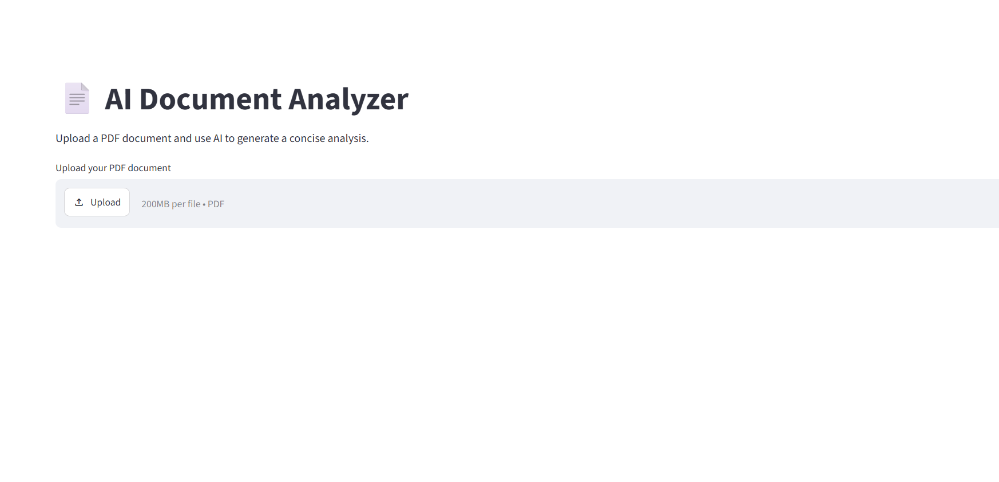
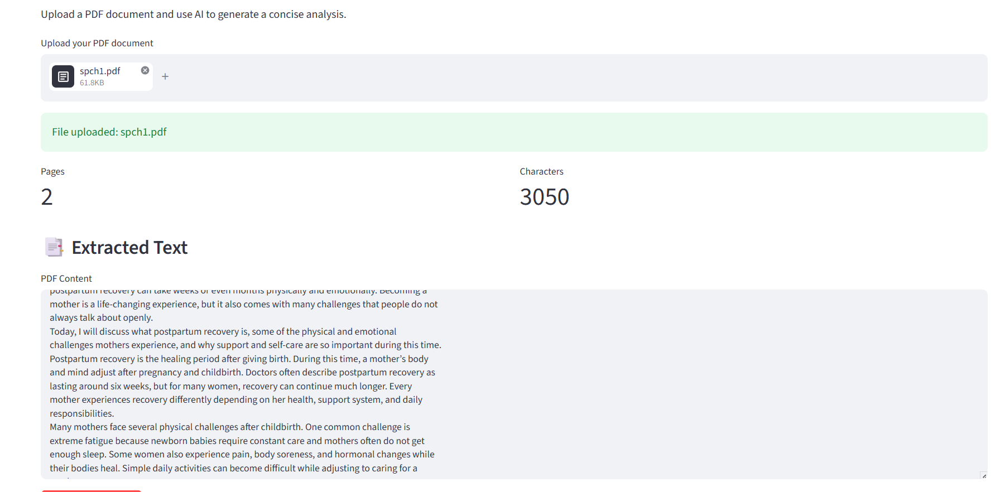
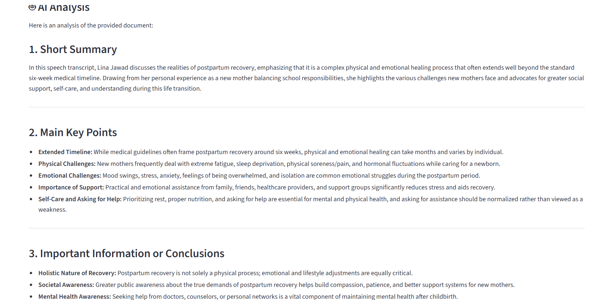

# 📄 AI Document Analyzer

An AI-powered document analysis application built with **Python, Streamlit, and Google Gemini**.

The application allows users to upload a PDF document, extract its text, and use Gemini AI to generate a concise analysis including a summary, key points, important conclusions, and the likely document type.

## 🚀 Features

* Upload PDF documents directly through a Streamlit interface
* Extract readable text from PDF files using `pypdf`
* Analyze document content using **Google Gemini 3.6 Flash**
* Generate:

  * Short document summary
  * Main key points
  * Important information and conclusions
  * Likely document type
* Display extracted text before AI analysis
* Handle PDFs with no readable text
* Secure API key management using environment variables

## 🛠️ Technologies Used

* **Python**
* **Streamlit** — Web application interface
* **pypdf** — PDF text extraction
* **Google Gemini API** — AI-powered document analysis
* **python-dotenv** — Environment variable management

## 🔄 How It Works

```text
User uploads PDF
       ↓
Streamlit receives the file
       ↓
pypdf extracts the document text
       ↓
Extracted text is sent to Gemini
       ↓
Gemini analyzes the document
       ↓
AI-generated analysis is displayed
```

## 📂 Project Structure

```text
AI-Document-Analyzer/
│
├── app.py
├── requirements.txt
├── .gitignore
└── .env              # Local only — not committed to Git
```

## ⚙️ Installation

### 1. Clone the repository

```bash
git clone https://github.com/linajawad/AI-Document-Analyzer.git
cd AI-Document-Analyzer
```

### 2. Create a virtual environment

```bash
python -m venv venv
```

Activate it on Windows:

```powershell
venv\Scripts\Activate.ps1
```

### 3. Install dependencies

```bash
pip install -r requirements.txt
```

### 4. Configure the Gemini API key

Create a `.env` file in the project root:

```env
GEMINI_API_KEY=your_api_key_here
```

The `.env` file is excluded from Git using `.gitignore` so the API key is not committed to the repository.

### 5. Run the application

```bash
streamlit run app.py
```

The application will open in your browser at:

```text
http://localhost:8501
```

## 🧪 Example Workflow

1. Upload a PDF document.
2. Review the extracted text.
3. Click **Analyze Document**.
4. Gemini processes the document.
5. The application displays the AI-generated analysis.

## 🔐 Security

The Gemini API key is loaded from an environment variable rather than being hard-coded in the source code.

The following files are excluded from version control:

```text
.env
venv/
__pycache__/
*.pyc
```

**Never commit your API key or other secrets to GitHub.**

## 🎯 Project Purpose

This project demonstrates practical experience with:

* AI API integration
* Python development
* Document processing
* PDF text extraction
* Prompt-based AI analysis
* Environment variable management
* Streamlit application development
* Git and GitHub workflow

It was built as part of an AI automation and technical portfolio to demonstrate the ability to connect an AI model to a functional application.

## 📌 Future Improvements

Potential future enhancements include:

* Support for additional document formats
* Better handling of scanned PDFs using OCR
* Structured AI output with separate sections for each analysis category
* Downloadable analysis reports
* Document history and comparison
* Improved error handling for API failures
* Deployment as a public Streamlit application

## 👩‍💻 Author

**Lina Jawad**

GitHub: `https://github.com/linajawad`
## 📸 Screenshots

### Main Interface


### AI Analysis


### Document Analysis

